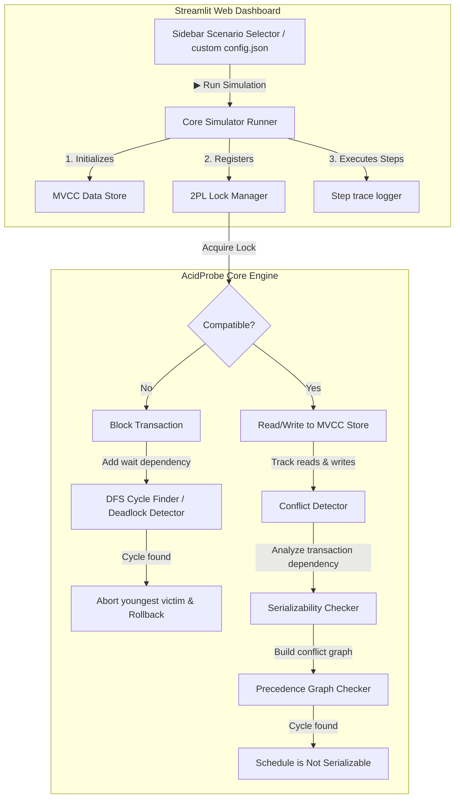

<div align="center">
  
# 🧪 AcidProbe

### A Premium Database Concurrency Simulator & ACID Violation Detector
  
[](https://python.org)
[](https://acidprobe---acid-violation-detector-73oz7ov9etfnlc4kj957ay.streamlit.app/)
CID-Violation-Detector/network/members)

</div>

---

> [!TIP]
> **Live App:** Try the simulator live in your browser at [acidprobe.streamlit.app](https://acidprobe---acid-violation-detector-73oz7ov9etfnlc4kj957ay.streamlit.app/)!


## 📖 Overview

**AcidProbe** is a premium, interactive educational tool designed to visualize database transactions, isolation levels, and ACID properties in real-time. It showcases how modern relational databases handle overlapping data operations under the hood using **Multi-Version Concurrency Control (MVCC)** and **Two-Phase Locking (2PL)**, detects scheduling anomalies (like Dirty Reads, Non-Repeatable Reads, and Lost Updates), and checks for **Conflict Serializability**.

With an elegant glassmorphic dark-slate visual interface built with Streamlit, AcidProbe lets you trace transaction step cards, view transaction execution timelines, inspect active lock tables, explore Graphviz wait-for/precedence graphs, and audit MVCC version records.

---

## 🛠️ System Architecture

AcidProbe implements a full transaction cycle with custom concurrency and recovery layers:



---

## 🌟 Key Features

*   🛡️ **Pessimistic Concurrency (2PL Lock Manager)**: Full lock scheduler with Shared (`S`) and Exclusive (`X`) lock types. Features lock compatibility checks, auto-upgrades, and interactive wait queues.
*   🔄 **Multi-Version Concurrency Control (MVCC)**: Keeps version chains for database values. Controls read visibility based on the active isolation level (`READ UNCOMMITTED`, `READ COMMITTED`, `REPEATABLE READ`, `SERIALIZABLE`).
*   💀 **DFS-Based Deadlock Manager**: Dynamically monitors lock blockages using a **Wait-For Graph**. Automatically runs cycle detection and resolves deadlocks by aborting and rolling back the youngest transaction.
*   ⚠️ **Anomaly Detector**: Automatically audits committed/uncommitted transactions for:
    *   **Dirty Reads**: Reading uncommitted modifications.
    *   **Non-Repeatable Reads**: Row value changes between read operations.
    *   **Lost Updates**: Simultaneous overwriting of concurrent operations.
*   📊 **Conflict Serializability Graph**: Constructs a precedence graph between conflicting transactions to determine conflict-serializability.
*   🔮 **Compact Graphviz Visualizations**:
    *   **Precedence Graph**: Highlights conflicts and highlights cycles.
    *   **Lock Wait-For Graph**: Highlights wait dependencies (`T1 ➔ T2`).
    *   **Deadlock Graph**: Displays the deadlock cycle state at the exact moment of rollback.

---

## 📂 Project Structure

```bash
AcidProbe/
├── core/
│   ├── data_store.py            # MVCC engine & version control chains
│   ├── detector.py              # Anomaly inspection suite
│   ├── lock_manager.py          # Lock table scheduler & DFS cycle detector
│   ├── serializable_checker.py  # Precedence graph compiler
│   └── transaction.py           # Transaction models & state controls
├── config.json                  # Local configuration template file
├── streamlit_app.py             # Streamlit application UI & renderer
├── .gitignore                   # Standard Python cache/venv exclusion patterns
└── README.md                    # Project documentation
```

---

## 🚀 Getting Started

### Prerequisites
*   Python 3.12+
*   `pip` package manager

### 1. Installation
Clone the repository to your local machine:
```bash
git clone https://github.com/JenishPatoliya/AcidProbe---ACID-Violation-Detector.git
cd AcidProbe---ACID-Violation-Detector
```

### 2. Install Dependencies
Install the required packages:
```bash
pip install streamlit pandas plotly
```

### 3. Run the Dashboard
Fire up the local development server:
```bash
streamlit run streamlit_app.py
```
The application will launch automatically in your default browser at `http://localhost:8501`.

---

## 💻 Dashboard Tabs Guide

| Tab | Purpose | Visualized Details |
| :--- | :--- | :--- |
| **⚡ Step Execution** | Operational Step-by-Step logs | Displays exact sequence of operations. Color-coded card statuses (**Green** = success, **Yellow** = blocked wait, **Red** = deadlock) with inline lock logs. |
| **📅 Timeline View** | Concurrent scheduling timeline | Structured lane matrix detailing overlapping transactions, wait times, and operations over time. |
| **⚠️ Anomaly Report** | Safety, serializability, & anomaly reports | Anomaly check status banners, serializability precedence graph cycles, lock wait dependencies, and deadlock cycles. |
| **🗃️ Storage & State** | MVCC logs & database commits | Final database key-value states and table traces showing timestamp, writer ID, and commit status of every value version. |

---

## 📚 Concurrency Deep Dive

### 1. Two-Phase Locking (2PL) Matrix
The Lock Manager schedules lock grants based on request compatibility:

| Requested \ Held | None | Shared (`S`) | Exclusive (`X`) |
| :--- | :---: | :---: | :---: |
| **Shared (`S`)** | ✅ Grant | ✅ Grant | ⏳ Wait |
| **Exclusive (`X`)** | ✅ Grant | ⏳ Wait | ⏳ Wait |

### 2. Transaction Isolation Matrix

| Isolation Level | Dirty Read | Non-Repeatable Read | Lost Update |
| :--- | :---: | :---: | :---: |
| **READ UNCOMMITTED** | ❌ Allowed | ❌ Allowed | ❌ Allowed |
| **READ COMMITTED** | ✅ Prevented | ❌ Allowed | ❌ Allowed |
| **REPEATABLE READ** | ✅ Prevented | ✅ Prevented | ❌ Allowed |
| **SERIALIZABLE** | ✅ Prevented | ✅ Prevented | ✅ Prevented |

### 3. Precedence Graph Conflict Detection
An edge $T_i \rightarrow T_j$ is drawn in the precedence graph if $T_i$ executes an operation on resource $Q$ before $T_j$, they access the same key, and at least one of their operations is a **WRITE**:
*   **Read-Write Conflict**: $T_i$ reads $Q$, then $T_j$ writes $Q$.
*   **Write-Read Conflict**: $T_i$ writes $Q$, then $T_j$ reads $Q$.
*   **Write-Write Conflict**: $T_i$ writes $Q$, then $T_j$ writes $Q$.

A cycle in the graph indicates a non-serializable schedule.

---

## 🛡️ License
Distributed under the MIT License. See `LICENSE` for more information.
